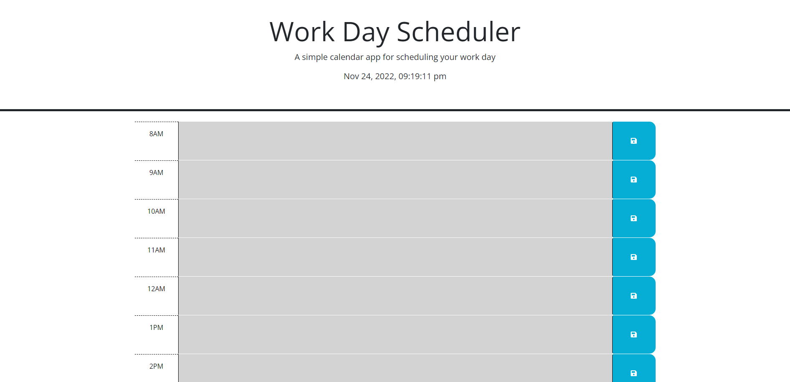

# Daily_Planner

## Description

This project was created to build a simple calendar apllication that allows users to save events for each hour of the working day.

[Daily Planner](https://zairabarry.github.io/Daily-Planner/)

## Usage

When you open a planner the current date is displayed at the top of the calendar which is presented with timeblocks for standard business hours. Each timeblock is colored to indicate past, present or future. You can enter the event which will be stored at local storage and displayed at text area.

## Credits

N/A

## License

Please refer to the LICENSE in the repo.
